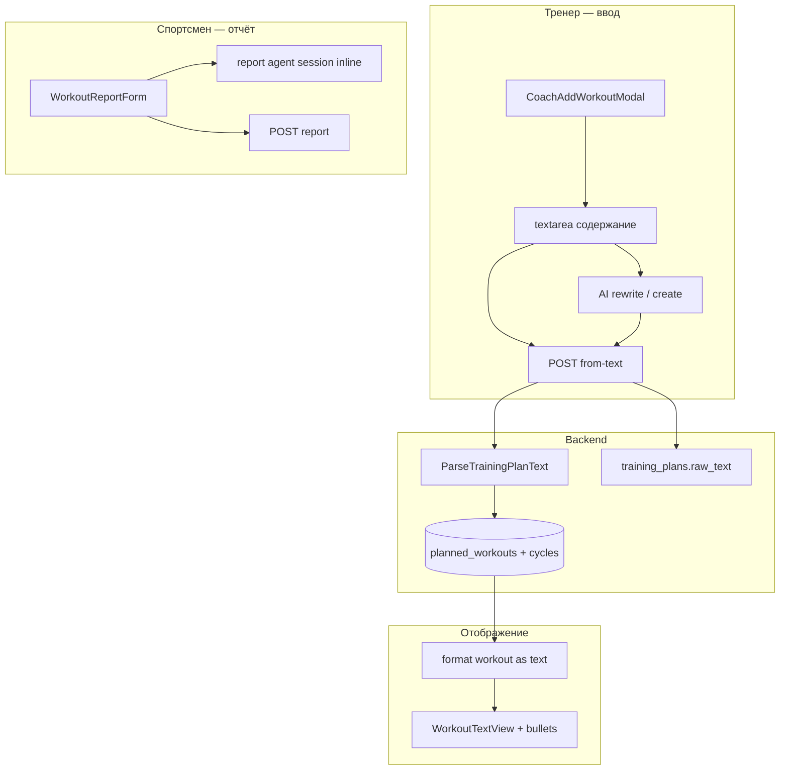

# MVP 5 — Текстовые формы тренировок

**Статус:** реализовано (MVP5-001–008)  
**Предыдущий:** [mvp-4.md](mvp-4.md) (UI redesign завершён)  
**Референсы:** `frontend/template/Athlete Cabinet.dc.html`, `FeedbackForm.dc.html`, `Trainer Cabinet.dc.html`

## Цель

Упростить ввод и просмотр тренировок: **текст, как в мессенджере**, вместо структурных блоков «разминка / основная / заминка» и тяжёлого структурного редактора в основном сценарии. Интерфейс должен быть привычным тренеру и спортсмену — вставил текст, увидел список с буллетами, отправил отчёт с RPE.

## Проблема (текущее состояние)

| Область | Сейчас | В новых шаблонах |
|--------|--------|------------------|
| Просмотр плана (спортсмен) | `TodayWorkoutCard`: разминка / основная / заминка + темп / пульс | Один текстовый блок с буллетами (`toLines`) |
| Просмотр плана (тренер) | `CoachDayDetailCard`: те же 3 блока + метрики | Текст плана + отчёт ниже |
| Создание плана | Модалка → AI-чат или **структурный редактор** (`TrainingPlanEditor`) | Модалка: дата + название + **большой textarea**, сохранение из модалки |
| AI при создании | Отдельные страницы `CoachPlanAgentChatPage` | Inline: «Переписать с ИИ» (diff), «Создать с ИИ» (preview) |
| Отчёт | `WorkoutReportForm` частично совпадает; AI — **отдельная страница** | Inline «✨ Составить отчёт с ИИ» внутри формы |
| RPE / настроение | `difficulty_rating` + `mood_rating` | Только RPE (1–10 pills) |
| Ссылка на активность | placeholder Garmin | «Ссылка на тренировку с часов» (Garmin / Strava / др.) |
| Раскладка «Сегодня» | План и отчёт всегда в ленте | Переключатель **Лента** / **Вкладки** (Задание \| Отчёт) |

Backend для текстового сценария **уже есть** (MVP 2.1): `raw_text`, `from-text`, `PATCH raw-text`, `GET .../training-plan/text`, парсер дня/недели. Менять схему БД в первой итерации не обязательно.

---

## Принципы реализации

1. **Текст — primary UX**, структура (cycles/exercises) — внутреннее представление после парсинга.
2. **Не ломать API**: `POST from-text`, agent sessions, structured create остаются.
3. **Структурный редактор упражнений удалить** с фронта (`TrainingPlanEditor`, страница `training/create`); единственный ввод плана — текст в модалке.
4. **Переиспользовать** `format_training_calendar_as_text` / клиентский аналог для отображения одного дня.
5. **Backend MVP5-006 обязателен** для ссылки на активность (любой https) и поля `title` при `from-text`; редактирование — через PATCH всего `raw_text`.

---

## Архитектура (целевая)



---

## Декомпозиция задач

### MVP5-001 — Общие утилиты и компонент отображения текста

**Файлы:** `frontend/src/utils/workoutText.js`, `frontend/src/components/training/WorkoutTextView.jsx`

- Портировать логику `toLines()` из шаблонов (plain / bullet / blank).
- `formatWorkoutDisplayText(workout)` — формат одного дня:
  - **v1:** клиентская сборка из `cycles` (зеркало `training_plan_text_export._format_workout_block` без заголовка даты);
  - **v2 (опционально):** поле `display_text` в `PlannedWorkoutResponse` с бэкенда.
- Компонент `WorkoutTextView`: заголовок дня, статус-chip, тело плана списком строк.
- Unit-тесты на `toLines` и форматирование (vitest или вынести в `frontend` test setup при появлении).

**Критерии приёмки**

- [ ] Один компонент используется и у спортсмена, и у тренера.
- [ ] Списки с `- ` рендерятся буллетами, пустые строки — отступом.

---

### MVP5-002 — Спортсмен: экран «Сегодня»

**Файлы:** `TodayScreen.jsx`, `TodayWorkoutCard.jsx` → замена на `WorkoutTextView`, `athlete.css`

- Убрать блоки разминка/основная/заминка и карточки темп/пульс из основного UI.
- Заголовок карточки: `{день недели} — {название}` + дата + status chip (как в шаблоне).
- Переключатель **Вид: Лента / Вкладки** (`localStorage`: `reps_athlete_home_style`):
  - **Лента:** план + форма отчёта / отправленный отчёт на одном скролле;
  - **Вкладки:** segmented «Задание» | «Отчёт».
- `SubmittedWorkoutReport` — зелёная карточка как в `FeedbackForm` / шаблоне.
- Пустые состояния: «День отдыха», «План появится ближе к дате».

**Критерии приёмки**

- [ ] Визуально соответствует `Athlete Cabinet.dc.html` (секция Today).
- [ ] Week strip и статусы дней без регрессий.
- [ ] Отчёт по-прежнему уходит через `submitWorkoutReport`.

---

### MVP5-003 — Форма отчёта (`FeedbackForm`)

**Файлы:** `WorkoutReportForm.jsx`, `feedback-form.css` (или `athlete.css`)

- Заголовок: «Отчёт о тренировке» + подзаголовок день · тип (как в шаблоне).
- **RPE only в UI:** один ряд pills 1–10 → `difficulty_rating`; **`mood_rating` всегда дублировать `difficulty_rating`** при submit (поле скрыто).
- Поле ссылки: label «Ссылка на тренировку с часов», placeholder нейтральный (`strava.com/…`); в API по-прежнему `garmin_url`, валидация — **любой https URL** (MVP5-006).
- **Inline AI** вместо перехода на `/report/ai`:
  - кнопка «✨ Составить отчёт с ИИ» + loading dots;
  - вызов `startReportAgentSession` + `sendReportAgentMessage` с `raw_report_text`;
  - появление textarea «Развёрнутое описание для тренера» (`comment`);
  - страница `AthleteReportAgentChatPage` остаётся как fallback / deep link.
- Collapsible «Вопрос тренеру» — без изменений логики (сообщение в чат).

**Критерии приёмки**

- [ ] Соответствует `FeedbackForm.dc.html` (состояния default / generating / result / submit).
- [ ] Ручной отчёт без AI работает.
- [ ] `npm run lint`, `npm run build` проходят.

---

### MVP5-004 — Тренер: модалка добавления тренировки

**Файлы:** `CoachAddWorkoutModal.jsx`, `coach.css`

Заменить текущий flow (brief → navigate to AI/editor) на шаблон **Trainer Cabinet** (секция ADD WORKOUT MODAL):

**Режим «Один день»**

- Поля: дата (`input type=date`), **название** (отдельное поле, optional), textarea «Содержание тренировки» (min-height ~220px).
- **Создание:** `createTrainingPlanFromText` (`scope: day`) + передать `title` в теле запроса (MVP5-006).
- **Редактирование:** загрузить `raw_text` недели (`GET .../training-plan/text`), подставить/заменить блок выбранного дня на фронте, **PATCH `raw-text` целиком**; `title` — отдельно на соответствующий `planned_workout` (PATCH title или в составе re-parse — см. MVP5-006).
- **✎ Переписать с ИИ** — plan agent session с текущим текстом; diff preview; принять / отклонить.
- **✨ Создать с ИИ** — генерация из краткого ввода; preview → вставить в textarea.

**Режим «Целая неделя»**

- 7 textarea (Пн–Вс) + **7 полей названия** (optional, по одному на день) или одна строка названия на день рядом с полем — как в шаблоне только textarea, названия в отдельных input.
- Сборка в один `raw_text` с заголовками дат → `from-text` (`scope: week`) или **PATCH `raw-text`** при редактировании существующей недели.
- «✨ Создать с ИИ» на всю неделю + preview по дням + подтверждение.
- «Сохранить неделю».

**Дополнительно**

- После сохранения — `reload()` на `CoachAthleteScreen`, закрытие модалки.
- Ссылок на `CoachCreateTrainingPlanPage` / структурный редактор **не оставлять** (см. MVP5-008).

**Критерии приёмки**

- [ ] Тренер может создать день/неделю **не выходя из модалки**.
- [ ] AI rewrite/create с preview как в шаблоне.
- [ ] Интеграционный сценарий: создать план → спортсмен видит текст на «Сегодня».

---

### MVP5-005 — Тренер: карточка дня

**Файлы:** `CoachDayDetailCard.jsx`, `useCoachAthleteWeekData.js`

- Заменить три блока + метрики на `WorkoutTextView`.
- Секция отчёта: текст + RPE + ссылка «Активность на часах» (если есть `garmin_url`).
- Empty states из шаблона: нет плана / нет отчёта / день отдыха / пропущено.

**Критерии приёмки**

- [ ] Соответствует athlete view в `Trainer Cabinet.dc.html`.
- [ ] Данные с реального API без регрессий compliance / week grid.

---

### MVP5-006 — Backend (обязательно)

| Изменение | Решение |
|-----------|---------|
| Редактирование плана | Всегда **PATCH `raw-text` целым текстом** недели; поддержать сценарии **день** и **неделя** в модалке (фронт мержит блок дня в недельный `raw_text`) |
| `mood_rating` | В UI скрыт; при submit **`mood_rating = difficulty_rating`** (дублировать RPE) |
| Ссылка на активность | Ослабить `GarminReportUrl`: **любой валидный https URL**; имя поля в API/БД **`garmin_url` без переименования** |
| Название тренировки | **Отдельное поле** в модалке → `planned_workouts.title`; расширить `from-text` / save-flow: `title` (день) и `titles` по дням (неделя) поверх парсера |
| `display_text` (опционально) | Поле в `PlannedWorkoutResponse` — если клиентский export из cycles недостаточен |

**Файлы (ориентир):** `garmin_report_url.py` → `ActivityUrl` или relaxed validation, `training_commands.py`, `schemas.py`, `training_text_commands.py`, тесты value objects.

**Критерии приёмки**

- [ ] Strava/Garmin/любой https проходит валидацию отчёта.
- [ ] `from-text` сохраняет `title` из запроса, не только из парсера.
- [ ] PATCH `raw-text` + re-parse сохраняет отчёты по прошедшим дням.
- [ ] Обратная совместимость: планы без `raw_text` отображаются (fallback export из cycles).

---

### MVP5-007 — Polish & QA

- Обновить `TODO.md` (отметить задачу форм).
- Ручной чеклист: спортсмен (лента/вкладки, отчёт, AI), тренер (день, неделя, просмотр отчёта).
- `pytest`, `npm run lint`, `npm run build`.

---

### MVP5-008 — Удаление лишнего UI

**Структурный редактор (пофайловый ввод упражнений) — удалить**

| Удалить / убрать | Примечание |
|------------------|------------|
| `TrainingPlanEditor.jsx` | Форма cycles/exercises |
| `CoachCreateTrainingPlanPage.jsx` | Страница + route `/coach/athletes/:id/training/create` |
| `createDayTrainingPlan` / `createWeekTrainingPlan` в `client.js` | Если больше не вызываются с фронта |
| Ссылки в `CoachAddWorkoutModal`, `CoachPlanAgentChatPage`, `CoachTrainingSections` | Fallback «структурный редактор» |
| `CoachTrainingSections.jsx`, `AthleteTrainingSections.jsx` | Legacy dashboard, не подключены к shell — удалить при отсутствии импортов |

**Оставить:** `TrainingPlanPreview.jsx` (preview AI-черновика в `AgentDraftPreview`), `CoachPlanAgentChatPage` (confirm draft через API, не через редактор).

**Графики дистанции — удалить**

| Где | Действие |
|-----|----------|
| `frontend/template/Athlete Cabinet.dc.html` | Убрать секции «Дистанция с начала месяца/года», SVG и bars из вкладки Прогресс |
| `ProgressScreen.jsx` | Уже без графиков (профиль + рекорды) — без изменений |
| CSS `.athlete-chart-*`, `.athlete-year-bars*` | Удалить остатки, если есть |

Backend structured API (`POST .../training-plans` day/week JSON) **можно оставить** для внутреннего парсера и AI confirm; убираем только UI-форму.

**Критерии приёмки**

- [ ] Нет route и навигации на структурный редактор.
- [ ] `npm run build` без мёртвых импортов.
- [ ] Шаблон Athlete Cabinet: вкладка «Прогресс» = профиль + личные рекорды (без графиков).

---

## Что сознательно **не** входит в MVP 5

- Переделка списка спортсменов / чата тренера (уже близко к шаблону после MVP4).
- Email invite modal (уже есть).

---

## Порядок работ

```
MVP5-001 (утилиты + WorkoutTextView)
    ↓
MVP5-002 (athlete today) ──┐
MVP5-005 (coach day card) ─┤ параллельно после 001
    ↓
MVP5-003 (feedback form)
    ↓
MVP5-004 (coach modal) — самая объёмная
    ↓
MVP5-006 backend (URL, title, raw-text merge helpers)
    ↓
MVP5-008 cleanup (удалить редактор + графики в шаблоне)
    ↓
MVP5-007 QA
```

Оценка: **~5–7 рабочих дней** (с обязательным MVP5-006).

---

## Принятые продуктовые решения

| # | Вопрос | Решение |
|---|--------|---------|
| 1 | Редактирование плана | **PATCH всего `raw_text`**; в UI — и **день**, и **неделя** (фронт собирает/мержит полный текст недели) |
| 2 | `mood_rating` | **Дублировать RPE** (`mood_rating = difficulty_rating`), в форме не показывать |
| 3 | Ссылка на активность | **Любой https URL**; поле API остаётся `garmin_url` |
| 4 | Название тренировки | **Отдельное поле** в модалке → `planned_workouts.title` |
| 5 | Структурный редактор | **Удалить** (не нужен, только текстовый ввод) |
| 6 | Графики дистанции | **Удалить** (в шаблоне; в приложении уже нет) |

---

## Риски и решения

| Риск | Митигация |
|------|-----------|
| Текст из cycles не совпадает с тем, что ввёл тренер | Приоритет `raw_text` среза дня; иначе export из cycles |
| Мерж одного дня в недельный `raw_text` на фронте | Утилита `mergeDayIntoWeekRawText` + тесты; формат дат как в парсере |
| Inline AI дублирует логику `AthleteReportAgentChatPage` | Вынести хук `useReportAgentSession(workoutId)` |
| Rewrite diff на фронте | Простой line-diff (как `computeDiff` в шаблоне); без merge conflict UI |
| `title` не входит в `raw_text` | Хранить в `planned_workouts.title`; показывать в заголовке карточки отдельно от тела |

---

## Связанные файлы (reference)

| Шаблон | Текущий код |
|--------|-------------|
| `FeedbackForm.dc.html` | `WorkoutReportForm.jsx`, `AthleteReportAgentChatPage.jsx` |
| `Athlete Cabinet.dc.html` (Today) | `TodayScreen.jsx`, `TodayWorkoutCard.jsx` |
| `Trainer Cabinet.dc.html` (modal + day) | `CoachAddWorkoutModal.jsx`, `CoachDayDetailCard.jsx`, `CoachCreateTrainingPlanPage.jsx` |
| `training_plan_text_export.py` | `fetchAthleteTrainingPlanText`, `createTrainingPlanFromText` |
